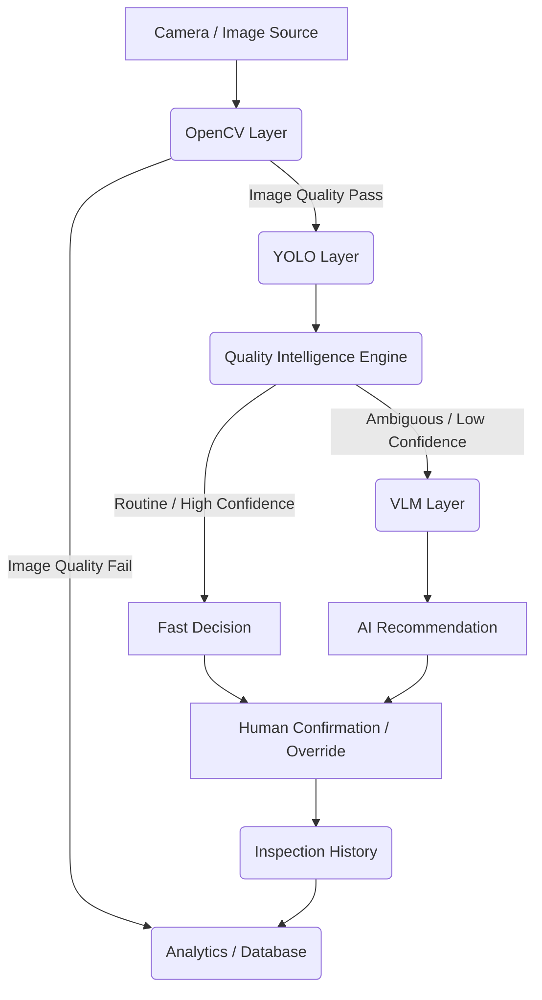

# System Architecture

## Overview
EXtendQuality bridges the gap between machine vision detection and quality decision-making by selectively escalating ambiguous cases to a Vision Language Model (VLM).

## Component Architecture

### 1. OpenCV Layer (Preprocessing)
**Responsibilities:**
- Checks image brightness, contrast, and blur.
- Validates that the image is suitable for inspection.
- Provides base measurements (e.g., region of interest extraction).

### 2. YOLO Layer (Defect Localization)
**Responsibilities:**
- Object detection for bearing defects (scratch, dent, rust).
- Outputs bounding boxes and confidence scores.

### 3. Quality Intelligence Engine (Orchestrator)
**Responsibilities:**
- Takes input from OpenCV and YOLO.
- Applies predefined rules to decide the routing path.
- **Fast Path:** For clear accepts/rejects.
- **Escalation Path:** For borderline/ambiguous cases requiring context.

### 4. VLM Layer (Cognitive Decisioning)
**Responsibilities:**
- Receives the raw image, YOLO bounding boxes (drawn on image or passed as text), and the SOP text.
- Analyzes the visual evidence in the context of the SOP.
- Outputs a structured recommendation (ACCEPT, REJECT, CLEAN_AND_REINSPECT) and a text reasoning.

### 5. API & Backend (FastAPI)
- `POST /inspect`: Main entrypoint for uploading an image and running the full pipeline.
- `POST /review`: Endpoint for human operators to confirm or override a decision.
- `GET /history`: Fetch inspection records.

### 6. Frontend (React)
- **Live Inspection**: Upload image, see OpenCV/YOLO steps visually.
- **Intelligence View**: Explanation of the fast vs. escalation path.
- **VLM View**: Read VLM reasoning and rules applied.
- **Human Panel**: Buttons to accept/override AI.
