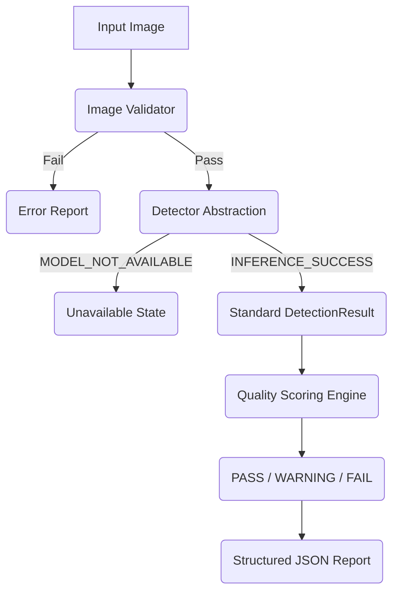

# Model Pipeline Architecture

## The Data Flow

## Independence from YOLO
The `Detector` class is the only component that directly interacts with YOLO (or any future model implementation). It outputs a `DetectionResult` containing a list of `Detection` objects. The `Quality Engine` consumes this standard contract, meaning the model can be swapped out without affecting the quality scoring rules.
